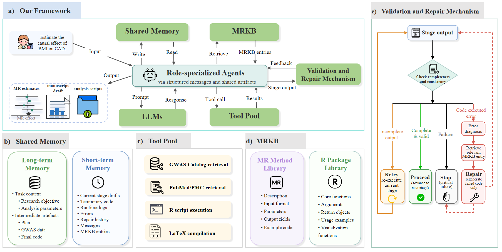
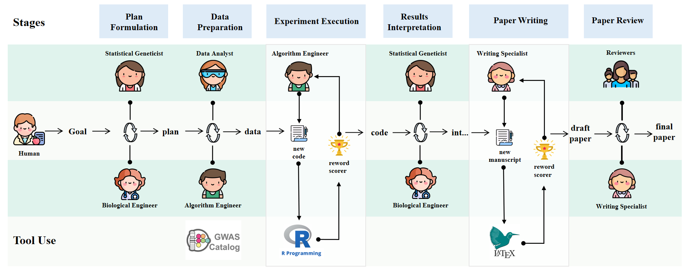

# MR-MAS

**MR-MAS: An End-to-End Multi-Agent System for Autonomous Mendelian Randomization Analysis**

MR-MAS is an end-to-end multi-agent framework for automated Mendelian Randomization (MR) analysis. It coordinates multiple large language model (LLM)-driven agents with external biomedical resources, local statistical computing tools, and a structured MR Knowledge Base (MRKB) to support scalable, standardized, and reproducible MR research.

## Overview

Mendelian Randomization is widely used for causal inference in biomedical research, but practical MR workflows often remain fragmented. A complete MR analysis usually requires GWAS data retrieval, instrumental variable selection, allele harmonization, causal effect estimation, sensitivity analysis, result interpretation, and manuscript preparation.

MR-MAS aims to reduce this workflow burden by organizing the full MR research process into a coordinated multi-agent pipeline. Given a user-defined exposure–outcome research objective, the system automatically performs research planning, GWAS data acquisition and preprocessing, MR analysis execution, result interpretation, scientific manuscript drafting, and paper review.

The system generates traceable research artifacts, including standardized GWAS datasets, executable R analysis scripts, MR statistical outputs, figures, interpretation reports, and manuscript drafts. All automatically generated results should be reviewed and validated by human researchers before being used as publication-level scientific evidence.

## Key Features

- **End-to-end MR automation**: Supports the complete workflow from research planning to manuscript drafting and review.
- **Multi-agent collaboration**: Coordinates role-specialized LLM agents, including Biological Engineer, Statistical Geneticist, Data Analyst, Algorithm Engineer, Writing Specialist, and Reviewer.
- **GWAS data preparation**: Retrieves and processes GWAS summary statistics from the GWAS Catalog.
- **TraitMatcher module**: Normalizes noisy, synonymous, misspelled, measurement-related, and multilingual trait queries for robust GWAS trait retrieval.
- **Local MR execution**: Generates and executes R scripts for MR analysis, sensitivity analysis, and result visualization.
- **MR Knowledge Base (MRKB)**: Uses structured YAML specifications of MR methods and R packages to support method-aware code repair.
- **Validation and repair mechanism**: Detects incomplete outputs or runtime errors and triggers proceed, retry, repair, or stop actions.
- **Reproducible artifacts**: Archives intermediate datasets, scripts, logs, statistical outputs, figures, and manuscript drafts.

## System Design

MR-MAS follows a stage-based workflow corresponding to six major phases.

### 1. Research Plan Formulation

The Biological Engineer and Statistical Geneticist agents refine the user-defined research objective into an executable MR analysis plan. This plan includes exposure and outcome definitions, GWAS search terms, instrumental variable criteria, MR method selection, and sensitivity analysis design.

### 2. GWAS Data Acquisition and Preprocessing

The Data Analyst and Algorithm Engineer agents retrieve GWAS summary statistics, select suitable datasets, and perform instrumental variable filtering, LD clumping, weak instrument removal, and allele harmonization.

### 3. MR Analysis Execution

The Algorithm Engineer generates executable R scripts for causal effect estimation, sensitivity analyses, and result visualization. The system runs the scripts locally and checks for syntax or runtime errors.

### 4. Results Interpretation

The Statistical Geneticist and Biological Engineer agents evaluate MR estimates, p-values, effect directions, heterogeneity, pleiotropy, and consistency across methods to produce a structured interpretation.

### 5. Scientific Manuscript Generation

The Writing Specialist agent converts the analysis outputs into a structured scientific manuscript draft using a LaTeX framework. The system also retrieves relevant literature from PubMed and PubMed Central to support the writing of the research background, related work, and result interpretation sections.

### 6. Paper Review

Reviewer agents assess the manuscript draft from multiple perspectives, including methodological rigor, clarity of presentation, novelty, and scientific significance. The system may terminate the workflow or return to earlier stages for targeted revision.

## Core Components

MR-MAS consists of five core components.

### 1. Role-Specialized Agents

The system uses multiple LLM-driven agents with explicit responsibilities:

- **Biological Engineer**: Provides biomedical background and supports causal interpretation.
- **Statistical Geneticist**: Designs MR strategies and evaluates statistical validity.
- **Data Analyst**: Retrieves GWAS datasets and manages data selection.
- **Algorithm Engineer**: Generates, executes, and repairs analysis scripts.
- **Writing Specialist**: Drafts scientific manuscripts and integrates analysis outputs.
- **Reviewer**: Reviews manuscript drafts and provides revision feedback.

### 2. Shared Memory

The shared memory module preserves contextual continuity across workflow stages.

- **Long-term memory** stores validated artifacts, including the research objective, analysis plan, harmonized GWAS datasets, final scripts, execution logs, MR results, and manuscript drafts.
- **Short-term memory** stores temporary stage-level information, including draft outputs, failed code, runtime errors, repair history, intermediate messages, and retrieved MRKB entries.

### 3. Tool Pool

The tool pool provides access to external resources and local computing environments, including:

- GWAS Catalog retrieval
- PubMed and PubMed Central literature retrieval
- Local R script execution
- LaTeX manuscript compilation

### 4. MR Knowledge Base

The MR Knowledge Base (MRKB) is a structured YAML-based knowledge base for organizing MR methodological and computational resources. It contains two main components:

- **MR Method Library**: Records method-level specifications, including method descriptions, input requirements, parameters, output fields, assumptions, and example code.
- **R Package Library**: Records package- and function-level information for MR-related R packages, including core functions, arguments, return objects, and usage examples.

MRKB supports error-driven code diagnosis and targeted repair during MR analysis execution.

### 5. Validation and Repair Mechanism

MR-MAS supports both automatic and human-in-the-loop execution modes. In automatic mode, the system proceeds through the predefined workflow after receiving the initial MR research objective. In human-in-the-loop mode, checkpoints are introduced after key stages, allowing users to inspect intermediate outputs and decide whether to proceed, rerun, or stop the current workflow.

MR-MAS supports four stage-level actions:

- **Proceed**: Move to the next stage when the output is complete and valid.
- **Retry**: Rerun the current stage when the output is incomplete or requires adjustment.
- **Repair**: Trigger MRKB-guided code repair when script execution fails.
- **Stop**: Terminate the workflow when critical inputs are missing or the error cannot be recovered.

During repair, failed code, error messages, and execution logs are stored in short-term memory. MR-MAS then retrieves relevant MRKB entries and uses them to guide targeted code regeneration.

## MR Methods

MR-MAS supports conventional and robust MR methods through MRKB, including:

- Inverse-Variance Weighted regression
- MR-Egger regression
- Weighted median
- Weighted mode
- MR-PRESSO
- MRMix
- GSMR
- CAUSE
- Related MR methods and package-specific implementations

The supported methods can be extended by adding new YAML entries to the MR Method Library and R Package Library.

## TraitMatcher

TraitMatcher is designed to improve GWAS trait retrieval under noisy input settings. It standardizes user-provided trait expressions and ranks candidate GWAS Catalog traits using lexical and semantic similarity.

The benchmark dataset for TraitMatcher evaluation is provided in:

`data/trait_queries.xlsx`

This dataset contains 168 queries constructed from 24 target traits, with seven query variants per trait. The query variants cover:

- Standard trait expressions
- Synonyms
- Misspellings
- Measurement-related expressions
- Chinese expressions

No additional external datasets are required for this experiment.

## Experimental Evaluation

MR-MAS was evaluated from multiple perspectives:

- **Analytical consistency**: MR-MAS reproduced literature-supported MR signals and maintained conservative interpretations for implausible, unsupported, or considered non-causal trait pairs.
- **Trait retrieval robustness**: TraitMatcher achieved strong Top-k retrieval performance under noisy and multilingual query settings.
- **Runtime and cost trade-off**: Different base model backends showed different trade-offs among execution time, API cost, and stage-level success rate.
- **Workflow robustness**: MRKB-guided repair improved code repair success compared with plain LLM-based repair.
- **Reproducibility**: Repeated workflow executions produced stable causal estimates despite moderate textual variability in generated scripts.

## Data Sources

MR-MAS primarily uses publicly available biomedical resources, including:

- GWAS Catalog for GWAS study retrieval and summary statistics
- PubMed and PubMed Central for literature retrieval
- Local R packages for MR analysis and visualization

For the TraitMatcher evaluation, the curated benchmark dataset is included in this repository as:

`data/trait_queries.xlsx`

The `assets/` directory is used for README images, the `data/` directory stores benchmark datasets, and the `mrkb/` directory stores structured YAML specifications for MR methods and R packages.

## Intended Use

MR-MAS is designed as a research assistant framework for automated MR analysis. It is intended to support researchers in organizing MR workflows, generating executable analysis scripts, improving workflow transparency, and preparing manuscript drafts.

MR-MAS should not be treated as a replacement for domain experts. Automatically generated MR results, interpretations, and manuscripts must be reviewed and validated by human researchers before publication or scientific decision-making.

## Limitations

MR-MAS cannot eliminate MR-specific statistical biases, including invalid instrumental variables, horizontal pleiotropy, weak instruments, sample overlap, population heterogeneity, or limitations caused by GWAS data quality. Its causal interpretations remain conditional on the validity of MR assumptions and the quality of the input datasets.

The current workflow follows a largely predefined stage structure. Future extensions may include more dynamic planning, adaptive scheduling, stronger randomness control, and broader large-scale validation.

## Code and Data Availability

The source code for MR-MAS and the MR Knowledge Base is available in this repository.

The code snapshot corresponding to the experiments reported in the manuscript has been archived on Zenodo:

**DOI:** `10.5281/zenodo.20342636`

## Citation

If you use MR-MAS in your research, please cite:

Wendi Wei, Yuling Fan, Lin Li, Thuc Duy Le, Xiaomei Li, Debo Cheng, and Zaiwen Feng.  
**MR-MAS: An End-to-End Multi-Agent System for Autonomous Mendelian Randomization Analysis.**

The formal citation information will be updated after publication.

## Disclaimer

This repository is provided for research purposes only. The outputs generated by MR-MAS are automatically produced and should be carefully checked by researchers with appropriate domain expertise. MR-MAS does not provide medical advice, clinical diagnosis, or treatment recommendations.
